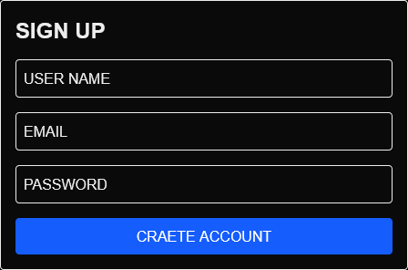
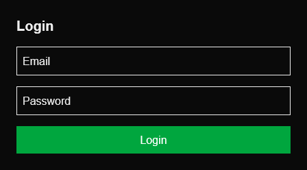
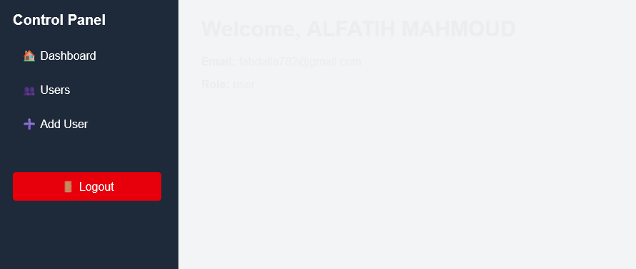
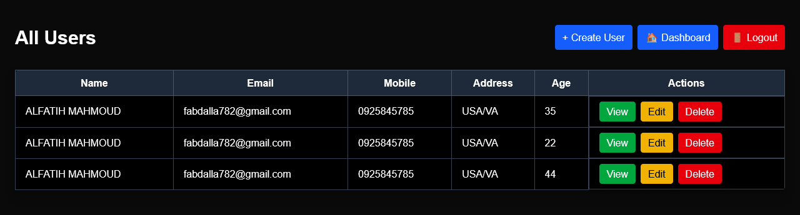
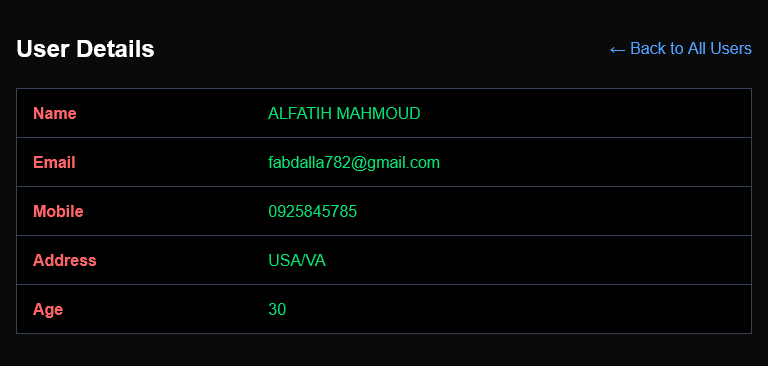
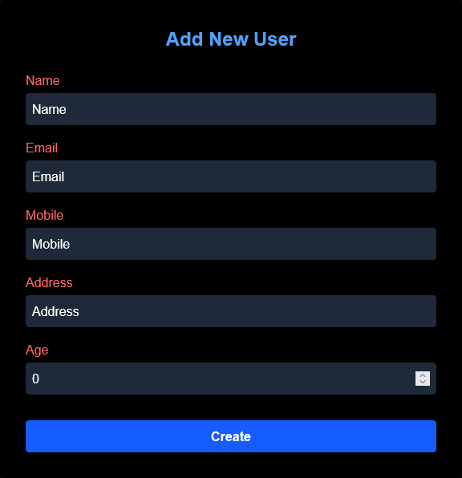
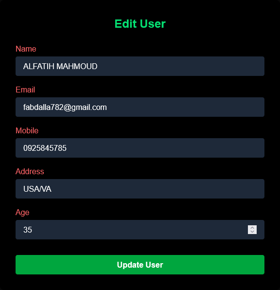

# Fullstack-Management App-CRUD- (Go + Next.js + MySQL)


This project is a fullstack CRUD (Create, Read, Update, Delete) application for user management.  
It is built with:

- **Go (Golang)** as the backend REST API
- **Next.js (React + TypeScript)** for the frontend
- **MySQL** as the database
- **JWT Authentication** for secure access

---

## 📁 Project Structure

```
/backend         # Golang API
/frontend        # Next.js frontend app
```

---

## 📸 Screenshots

### 📝 Sign Up



### 🔐 Login



### 📋 Dashboard



### 👥 View All Users



### 👤 User Details



### ➕ Add User



### ✏️ Edit User




---


## 🚀 Features

- Create, update, delete, and view users
- JWT-based authentication
- CORS support
- MySQL relational storage
- Responsive UI using Tailwind CSS

---

## 🧰 Prerequisites

- [Go](https://go.dev/doc/install) v1.20+
- [Node.js & npm](https://nodejs.org/) v18+
- [MySQL](https://www.mysql.com/)
- [Git](https://git-scm.com/)

---

## 🏗️ Setup Instructions

### 1. 📦 Clone the Repository

```bash
git clone https://github.com/fatihg80/Fullstack-User-Management-CRUD-App-with-Go-MySql-Next.js.git
cd your-repo-name
```

---

## 🖥️ Backend Setup (Go)

### 2. 🛠️ Configure MySQL

Create a MySQL database:

```sql
CREATE DATABASE userdb;
```

Create `users` table:

```sql
CREATE TABLE users (
  id INT AUTO_INCREMENT PRIMARY KEY,
  name VARCHAR(100),
  email VARCHAR(100),
  mobile VARCHAR(20),
  address TEXT,
  age INT
);
```

Create `auth_users` table:

```sql
CREATE TABLE auth_users (
  id INT AUTO_INCREMENT PRIMARY KEY,
  username VARCHAR(50) NOT NULL UNIQUE,
  email VARCHAR(100) NOT NULL UNIQUE,
  password VARCHAR(255) NOT NULL,
  role ENUM('admin', 'user') DEFAULT 'user',
  created_at TIMESTAMP DEFAULT CURRENT_TIMESTAMP
);

```

Create `token_blacklist` table:

```sql
CREATE TABLE token_blacklist (
  id INT AUTO_INCREMENT PRIMARY KEY,
  token TEXT NOT NULL,
  blacklisted_at TIMESTAMP DEFAULT CURRENT_TIMESTAMP
);

```

### 3. 🔧 Configure Environment

Edit `main.go` and set your MySQL DSN:

```go
// Example DSN
"username:password@tcp(localhost:3306)/userdb"
```

### 4. 🧬 Install Go Modules

```bash
cd backend
go mod tidy
```

### 5. ▶️ Run Go API Server

```bash
go run main.go
```

By default, it runs on: `http://localhost:5000`

---

## 🌐 Frontend Setup (Next.js)

### 6. 📂 Install Node Dependencies

```bash
cd frontend
npm install
```

### 7. ⚙️ Configure API URL

Update the `axios.ts` file under `frontend/utils/`:

```ts
const axios = Axios.create({
  baseURL: 'http://localhost:5000', // Backend URL
  withCredentials: true
})
```

### 8. ▶️ Run Development Server

```bash
npm run dev
```

Open in browser: [http://localhost:3000](http://localhost:3000)

---

## 🧪 API Endpoints

| Method | Endpoint           | Description            |
|--------|--------------------|------------------------|
| GET    | `/all_users`       | Get all users          |
| GET    | `/users/:id`       | Get single user        |
| POST   | `/users`           | Create new user        |
| PUT    | `/users/:id`       | Update existing user   |
| DELETE | `/users/:id`       | Delete user            |

---

## 🔐 Authentication (JWT)

- Backend issues JWT tokens on login
- Protected routes require the token
- Tokens are stored via cookies/localStorage (your choice)

---

## 📦 Build for Production

### Backend

```bash
go build -o server main.go
```

### Frontend

```bash
npm run build
npm start
```

---

## ✅ Deployment Tips

- Use **Nginx** or **Caddy** as a reverse proxy for Go API
- Serve frontend using **Vercel**, **Netlify**, or as static files
- Use **.env** files or secret managers for sensitive configs

---

## 🧹 Troubleshooting

- ❌ **CORS issues?**: Make sure your Go server includes proper `Access-Control-Allow-*` headers
---

## 🤝 Contributing

Pull requests and feature suggestions are welcome. Please open an issue first to discuss changes.

---

## 📝 License

MIT License
